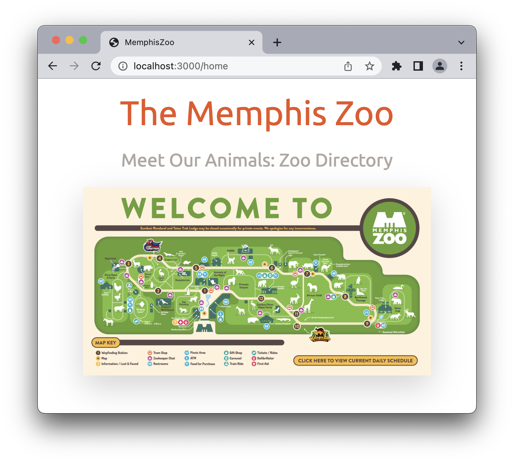
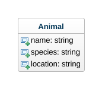
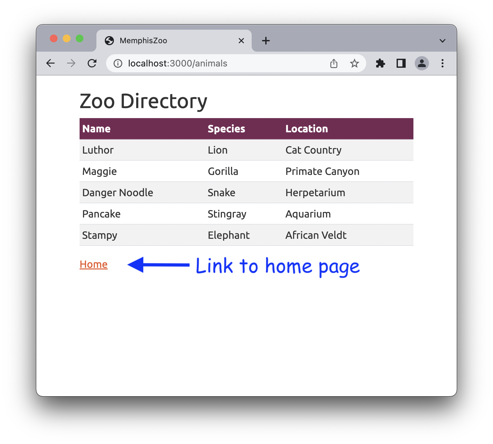
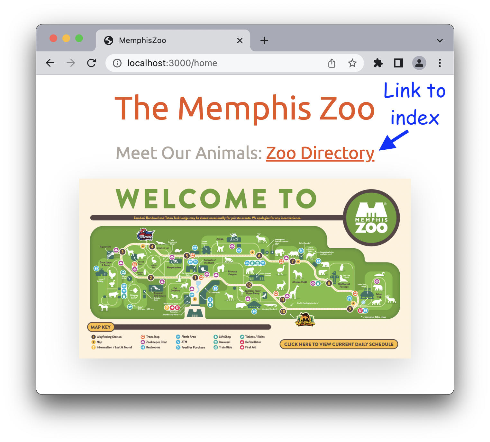

# Skills Test ST1

## The Rules

- Closed neighbor.
- No texting/messaging/posting.
- Referring to the Demos-n-Deets and searching the web is OK.

## Starting the Test

1. `cd` into your workspace directory (this command may vary depending on how you named your directory):

    ```bash
    cd ~/workspace
    ```

2. Clone this repository into a working directory named `st1`:

    ```bash
    git clone PASTE_THE_REPO_URL_HERE ./st1
    ```

3. `cd` into the working directory:

    ```bash
    cd st1
    ```

4. Open the working directory in VS Code:

    ```bash
    code ./
    ```

5. Do the usual 2-step to initialize the project:

    ```bash
    bundle install
    rails db:migrate:reset db:seed
    ```

## About the Base App

Initially, the base app contains the following:

- A `PagesController` controller class.
- The route, controller action, and view template for a home page.
- A root route that redirects to the home page.

If you run the base app and open <http://localhost:3000> in your browser, the following page should be displayed:

<p align="center">
    
</p>

## Tasks to Perform

1. **Model Class.** Create an `Animal` model class as per this class diagram (don't worry about adding attribute validations):

    

2. **Seed Data.** Add the following seed data to the seeds file, and then seed the database (to save you time, I've written the data in the form of partially complete code that you can copy and paste):

    ```text
      name: 'Luthor',
      species: 'Lion',
      location: 'Cat Country'

      name: 'Maggie',
      species: 'Gorilla',
      location: 'Primate Canyon'

      name: 'Danger Noodle',
      species: 'Snake',
      location: 'Herpetarium'

      name: 'Pancake',
      species: 'Stingray',
      location: 'Aquarium'

      name: 'Stampy',
      species: 'Elephant',
      location: 'African Veldt'
    ```

3. **Index Page.** Create an index page for the Animal model that looks like this, following the standard naming conventions used in the demos (note the URL):

    <p align="center">
        
    </p>

    **Important! Do not forget to add a link to the home page!**

    Don't worry too much about the styling of things, but, if you want to make your table look exactly the same as the picture, the table styles are:
    
        <table class="table table-sm table-striped">
            <thead class="table-dark">

4. **Hyperlink.** Add a link from the home page to the index page that looks like this:

    <p align="center">
        
    </p>

## How to Submit

Once you've completed all of the above, submit your work by doing the following:

1. Commit all your changes to the local repo:

    ```bash
    git add -A
    git commit -m "Completed skills test"
    ```

2. Generate a ZIP archive of your project by running the following command:

    ```bash
    git archive -o ../st1-submission.zip --prefix=st1-submission/ HEAD
    ```

    This command should result in a file `st1-submission.zip` being created in your `workspace` folder.

3. Upload this ZIP file to the appropriate dropbox in Canvas.

    Hint: Windows users can run these commands to open a file explorer for their workspace folder:

    ```bash
    cd ..
    explorer.exe .
    ```
